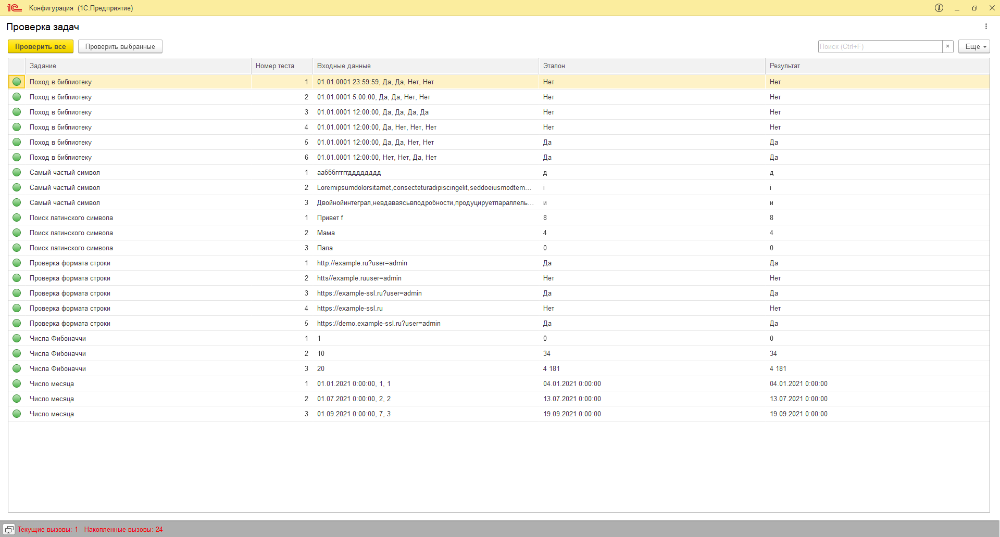

# Курсовая работа по итогам блока "Встроенный язык"

## Подготовка к решению задач

1. Скачайте каркасную конфигурацию [diploma-2-start.cf](src/diploma-2-start.cf) 
2. Создайте пустую информационную базу и загрузите в нее полученную конфигурацию
3. Откройте в конфигураторе общий модуль РешениеЗадачПереопределяемый

## Решение задач

В методах общего модуля РешениеЗадачПереопределяемый реализуйте алгоритмы в соответствии с условиями задач. Правильность решения можно проверять автоматически. 

Для этого запустите информационную базу в пользовательском режиме и воспользуйтесь командой "Проверить все". Если результаты работы алгоритма соответствуют эталонным, то в каждой строке появится зеленый индикатор.

Можно проверить только выбранные строки с помощью команды "Проверить выбранные".

При проверке дополнительно выводится информация какие параметры передаются в функцию при проверке, какой ожидается эталонный ответ и какой ответ вернула текущая версия функции.

Перечень задач:
1. [Поиск дня в месяце](tasks/task-1.md)
2. [Поиск латинского символа](tasks/task-2.md)
3. [Самый частый символ](tasks/task-3.md)
4. [Проверка формата строки](tasks/task-4.md)
5. [Числа Фибоначчи](tasks/task-5.md)
5. [Поход в библиотеку](tasks/task-5.md)

## Результат выполнения

Для проверки отправьте выгрузку конфигурации (.cf), в которой в каждом методе модуля РешениеЗадачПереопределяемый реализован алгоритм соответствующей задачи. 

Перед отправкой убедитесь, что при запуске в пользовательском режиме при нажатии кнопки "Проверить все" во всех строках отображается зеленый индикатор:

